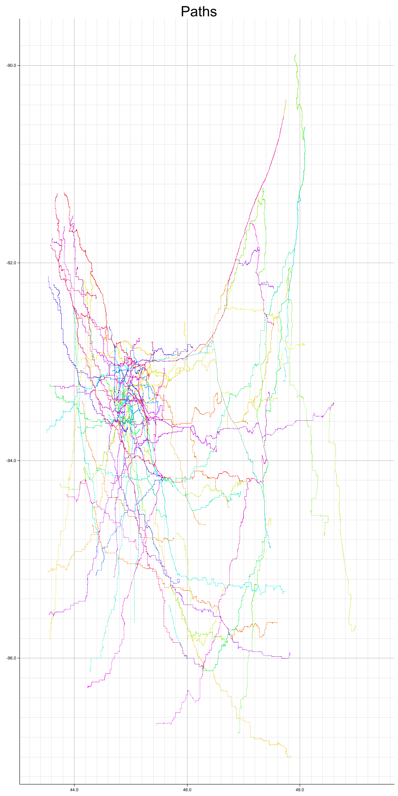

# RustOpenStreetMap
My final project for CSCI 4511W Artificial Intelligence @ UMN. The program runs A* throughout Minnesota and uses data provided by OpenStreetMap.

## Example paths
Here is an image of generated paths given two random points and traversed with parallel bi-directional A*.

